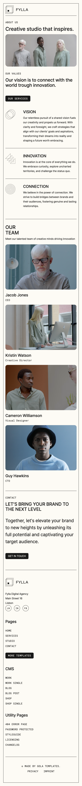

# 반응형 메거진 웹 퍼블리싱
html,css 마크업 페어프로그래밍 실습
## 목차 
- [개요](#개요)  
- [주제](#주제)  
- [진행기간](#진행기간)
- [사용언어](#사용언어)
- [디렉토리 구조](#디렉토리_구조)
- [UI](#UI)
- [멤버](#멤버)  

## 개요
`HTML`, `CSS`를 활용한 웹페이지를 제작 프로젝트.  

단말기의 유형, 화면 해상도, 뷰포트 너비 등에 따라 사이트의 스타일(CSS)적용하는 **미디어 쿼리(Media Query)** 를 사용한 반응형 웹. 

**반응형 분기점**
1. `0`px ~ `767`px  
2. `768`px ~ `1023`px  
3. `1024`px ~   
   
## 주제 
매거진 사이트를 **반응형 웹** 으로 제작하기
## 진행기간
`2024.04.22` ~ `2024.04.23`
## 사용언어
   
  

## 디렉토리_구조
```plantext
📦pda-pair-programming
 ┣ 📂imgs
 ┣ 📂style
 ┃ ┣ 📜common.css
 ┃ ┣ 📜front_page.css
 ┃ ┣ 📜reset.css
 ┃ ┣ 📜responsive.css
 ┃ ┣ 📜responsive_mob.css
 ┃ ┣ 📜services.css
 ┃ ┗ 📜studio.css
 ┣ 📜index.html
 ┣ 📜services.html
 ┗ 📜studio.html
```
## UI
### `index.html` 페이지  
| 반응형 분기점         | `0px ~ 767px`                      |  `768px ~ 1023px`                     |  `1024px 이상`                        |
|-----------------|------------------------------------|---------------------------------------|---------------------------------------|
|                |        |           |        |

### `services.html` 페이지  
| 반응형 분기점         | `0px ~ 767px`                      |  `768px ~ 1023px`                     |  `1024px 이상`                        |
|-----------------|------------------------------------|---------------------------------------|---------------------------------------|
|                |        |           |        |
### `studio.html` 페이지  
| 반응형 분기점         | `0px ~ 767px`                      |  `768px ~ 1023px`                     |  `1024px 이상`                        |
|-----------------|------------------------------------|---------------------------------------|---------------------------------------|
|                |        |           |        |
## 멤버
| 멤버   |     깃허브    |
|--------|--------------|
| 박소연 | [https://github.com/soyalattee](https://github.com/soyalattee) |
| 오수연 | [https://github.com/sooyeon-kr](https://github.com/sooyeon-kr) |
